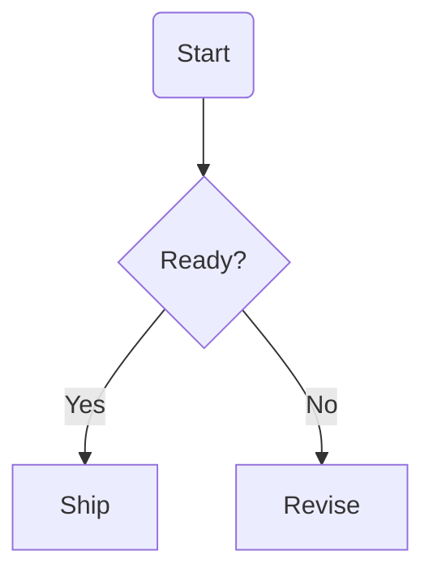

# Mermaid import

99draw can turn a small Mermaid flowchart into editable shapes and connectors.
This is useful when a workflow starts as text in an issue, pull request or
design note.

Open the command palette and run `Import Mermaid flowchart`, then paste a
Mermaid flowchart:

## Supported syntax in v1

The v1 importer is intentionally small:

- chart declarations: `flowchart TD`, `flowchart TB`, `flowchart LR` and
  `flowchart RL`;
- connectors: `A --> B`;
- connector labels: `A -->|Yes| B`;
- process nodes: `A[Label]`;
- decision nodes: `A{Question?}`;
- start/end nodes: `A(Start)`;
- Mermaid comments that start with `%%`.

Unknown Mermaid syntax is ignored. If no supported edge can be read, 99draw
keeps the current diagram and shows an import error.

## Notes

Mermaid import is not a Mermaid renderer. It creates native 99draw nodes and
connectors so the diagram can be edited, styled, saved and exported like any
other `.99draw.json` document.
